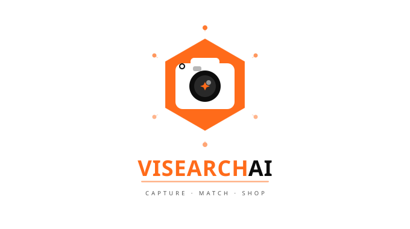
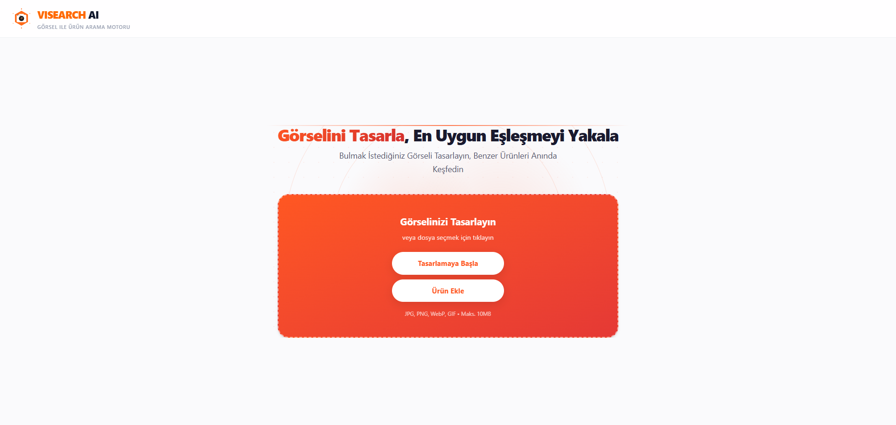
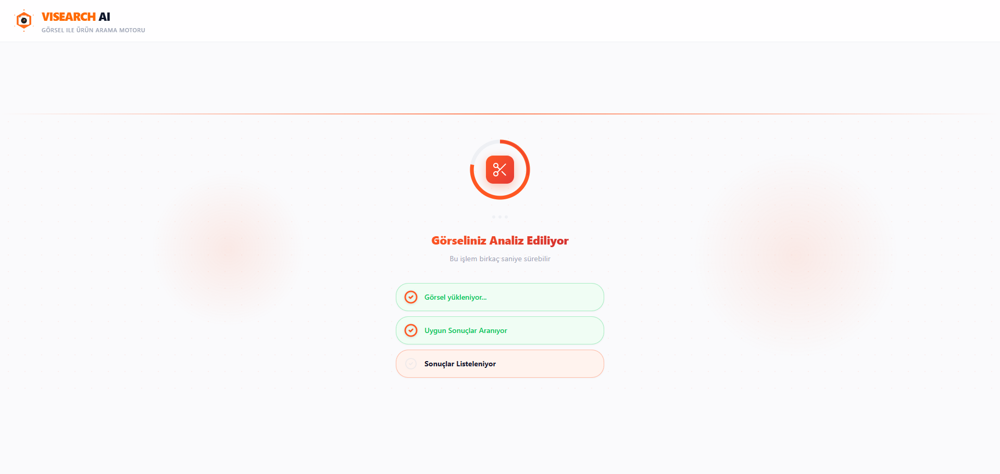
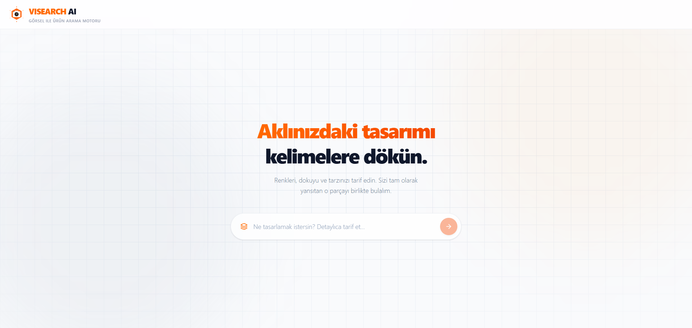
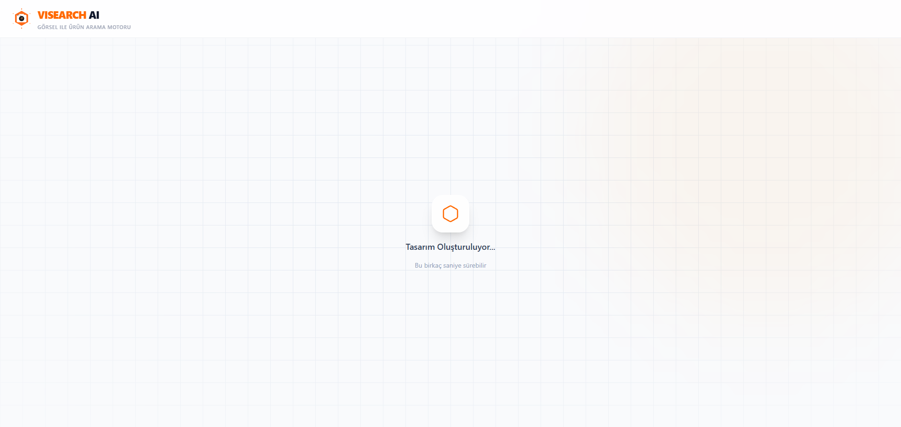
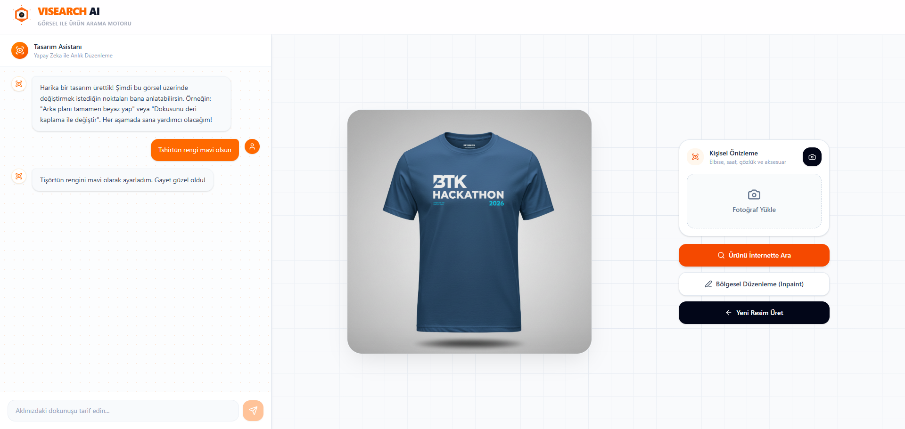
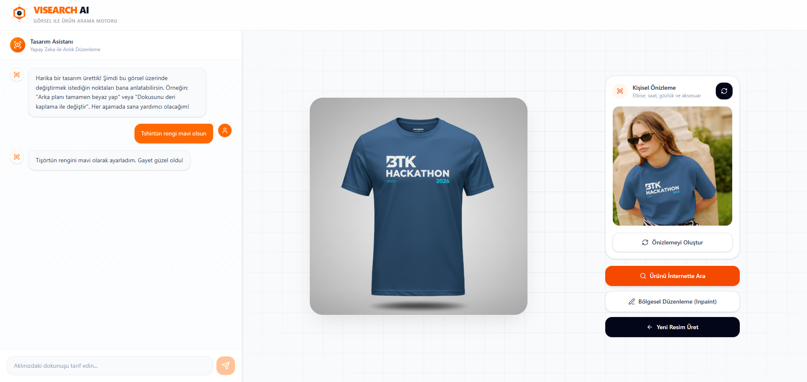
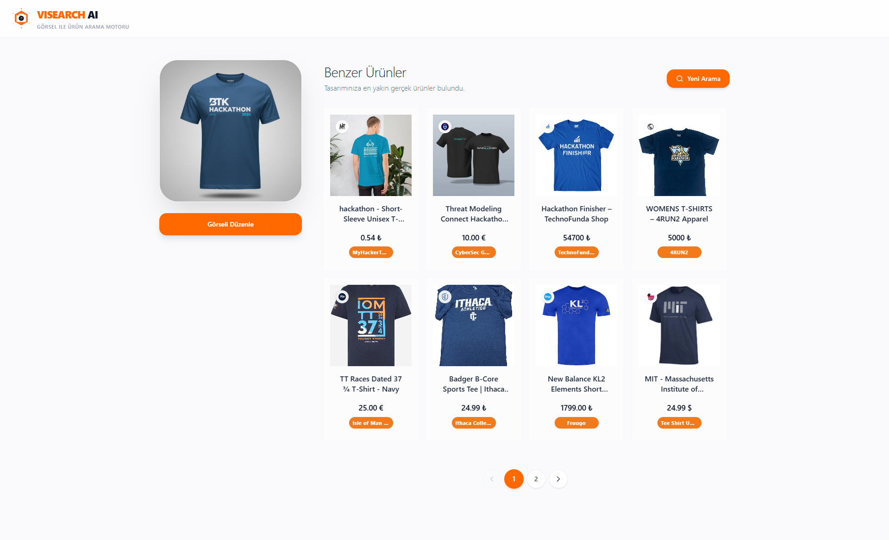
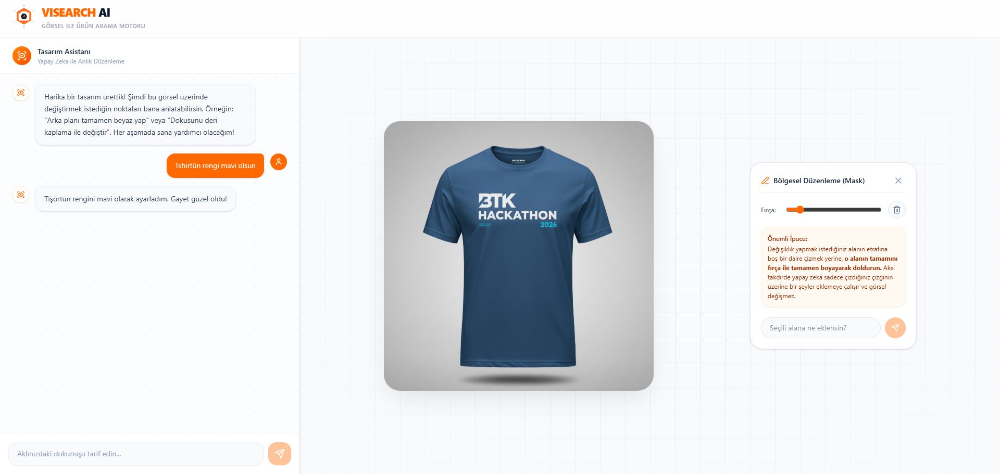

# ViSearch AI

### Yapay Zeka Destekli Yeni Nesil Görsel E-Ticaret Platformu

<p align="center">
  
</p>

<p align="center">
  <a href="https://btk-hackathon-2026.vercel.app" target="_blank">
    
  </a>
  &nbsp;&nbsp;
  <a href="https://your-video-link.com" target="_blank">
    
  </a>
</p>

<p align="center">
  
  
  
  
  
  
  
</p>


---

## 🔗 Proje Bağlantıları

- **🌐 Canlı Web Sitesi (Demo):** [Uygulamayı Canlıda Deneyimleyin (Vercel/Render)](https://btk-hackathon-2026.vercel.app)
- **🎥 Proje Tanıtım Videosu:** [YouTube Üzerinden Detaylı Tanıtımı İzleyin](https://your-video-link.com)

---

## 👥 Geliştiriciler

- Lütfü Bedel
- Şahin Kaya

---

## 📖 Proje Hakkında

**ViSearch AI**, kullanıcıların ürün görselleri yükleyerek veya yapay zeka destekli sohbet arayüzü ile ürünleri değiştirerek (Örn: "Bu elbisenin rengini kırmızı yap") internette benzer ürünleri anında bulmasını sağlayan yenilikçi ve akıllı bir e-ticaret arama platformudur. Proje, en son üretken yapay zeka modelleri (**Google Gemini** & **Vertex AI Imagen**) ve güçlü e-ticaret görsel arama API'leri (**SerpAPI**) entegre edilerek geliştirilmiştir.

---

## 📸 Ekran Görüntüleri

| Görsel 1 | Görsel 2 |
| :------: | :------: |
|  |  |
| Görsel 3 | Görsel 4 |
|  |  |
| Görsel 5 | Görsel 6 |
|  |  |
| Görsel 7 | Görsel 8 |
|  |  |

---

## ✨ Temel Özellikler

- **Görsel ile Arama:** Kullanıcılar kendi görsellerini yükleyerek veya sürükle-bırak yaparak web üzerinde benzer ürünleri anında bulabilir.
- **Yapay Zeka ile Görsel Düzenleme:** Yüklenen görseller üzerinde **Google Gemini** ve **Vertex AI Imagen** teknolojisi kullanılarak sohbet arayüzüyle interaktif değişiklik yapma imkanı (Örn: kıyafet rengi değiştirme, ürün materyalini değiştirme vb.).
- **Gerçek Zamanlı Sohbet Arayüzü:** Yapay zeka ile doğal dilde konuşarak ürünleri isteğinize göre modifiye etme ve saniyeler içinde yeni görsel üretme.
- **Kapsamlı E-Ticaret Entegrasyonu:** **SerpAPI** (Google Lens/Alışveriş API'leri) aracılığıyla gerçek e-ticaret sitelerindeki (Amazon, Trendyol vb.) ürünlerin fiyatlarını, görsel bağlantılarını ve satıcı detaylarını tek bir ekranda listeleme.
- **Hızlı ve Modern Arayüz:** **React 19**, **Vite** ve **Tailwind CSS v4** ile sıfırdan geliştirilmiş, tamamen duyarlı (responsive), akıcı ve premium kullanıcı deneyimi sunan tasarım.
- **Güvenli ve Hızlı Depolama:** Kullanıcılar tarafından yüklenen veya üretilen görseller yüksek erişilebilirliğe sahip **Cloudflare R2** obje depolama servisi üzerinde geçici ve güvenli olarak barındırılır.

---

## 🛠️ Kullanılan Teknolojiler

### 🖥️ Frontend (İstemci Tarafı)

- **Framework:** React 19 & Vite (Hızlı geliştirme ve optimize edilmiş build süreci)
- **Styling:** Tailwind CSS v4 (Hızlı ve modern UI geliştirme)
- **Routing:** React Router v7
- **İkonlar ve UI:** Lucide React, React Hot Toast (Kullanıcı bildirimleri)
- **State Management:** Gelişmiş React Hooks (Uygulama genelinde Lifted State mimarisi)

### ⚙️ Backend (Sunucu Tarafı)

- **Core:** Node.js & Express.js
- **Yapay Zeka SDK'ları:** `@google/genai` (Google Gemini SDK), Google Cloud Platform kimlik doğrulama.
- **Arama Motoru:** SerpAPI (Görsel ve alışveriş arama algoritmaları için)
- **Bulut Depolama:** AWS SDK S3 (S3 uyumlu yapısıyla Cloudflare R2 entegrasyonu için)
- **Araçlar ve Kütüphaneler:** Multer (Dosya yüklemeleri), CORS, dotenv, UUID

---

## 📂 Dosya Dizini ve Mimari

```text
btk-hackathon-2026/
├── backend/                  # RESTful API Sunucusu (Node.js)
│   ├── index.js              # Ana sunucu dosyası ve express app ayarları
│   ├── routes/               # API Endpoint tanımlamaları (search, generate vb.)
│   ├── services/             # Harici servis yönetimleri (Gemini, R2, SerpAPI)
│   ├── middleware/           # Resim yükleme (Multer) ve yetkilendirme
│   ├── .env.example          # Backend ortam değişkenleri referans şablonu
│   └── package.json          # Backend bağımlılıkları ve script'leri
│
├── frontend/                 # React SPA (Single Page Application)
│   ├── src/
│   │   ├── components/       # Yeniden kullanılabilir parçalı UI bileşenleri (Header vb.)
│   │   ├── pages/            # Sayfa bileşenleri (StartScreen, PromptScreen, vb.)
│   │   ├── App.jsx           # Ana yönlendirme ve global durum yönetimi
│   │   ├── index.css         # Temel stiller, animasyonlar ve Tailwind direktifleri
│   │   └── main.jsx          # Uygulama render noktası
│   ├── public/               # Logolar, ikonlar ve uygulamanın statik görselleri
│   ├── index.html            # Ana HTML şablonu
│   ├── tailwind.config.js    # Tailwind tema ve renk yapılandırması
│   ├── vite.config.js        # Vite derleme (build) ayarları
│   └── package.json          # Frontend projesi bağımlılıkları
│
└── README.md                 # Proje genel dökümantasyonu (Bu dosya)
```

---

## 🚀 Kurulum ve Çalıştırma Adımları

Projeyi kendi bilgisayarınızda yerel olarak (localhost) çalıştırmak için aşağıdaki adımları sırasıyla takip edebilirsiniz.

### 1. Sistem Gereksinimleri

- **Node.js** (v18.x veya üzeri bir sürüm yüklü olmalıdır)
- **npm** (veya **yarn** / **pnpm**)
- _Gerekli API Anahtarları:_ Google Gemini API Key, Google Cloud Service Account (.json), SerpAPI Key, Cloudflare R2 erişim bilgileri.

### 2. Depoyu Klonlama

Proje dosyalarını yerel bilgisayarınıza indirin ve dizine girin:

```bash
git clone https://github.com/lutfubedel/btk-hackathon-2026.git
cd btk-hackathon-2026
```

### 3. Backend Sunucusunu Ayağa Kaldırma

Terminalinizde (cmd/powershell/bash) sırasıyla:

```bash
cd backend
npm install
```

`backend` dizini altında `.env` adında bir dosya oluşturun ve içini `.env.example` dosyasını baz alarak kendi verilerinizle doldurun:

```env
# Cloudflare R2 Storage Ayarları
R2_ACCOUNT_ID=sizin_hesap_id_niz
R2_ACCESS_KEY_ID=sizin_access_key_iniz
R2_SECRET_ACCESS_KEY=sizin_secret_key_iniz
R2_BUCKET_NAME=sizin_bucket_isminiz
R2_PUBLIC_URL=sizin_public_r2_baglantiniz

# SerpAPI Ayarları (Ürünleri bulmak için)
SERPAPI_API_KEY=sizin_serpapi_anahtarınız

# Google Gemini ve Vertex AI (Yapay Zeka Ayarları)
GEMINI_API_KEY=sizin_gemini_api_anahtariniz
GOOGLE_CLOUD_PROJECT_ID=google_cloud_proje_kimliginiz
GOOGLE_CLOUD_LOCATION=us-central1
GOOGLE_APPLICATION_CREDENTIALS=./service-account.json
IMAGEN_API_KEY=sizin_imagen_api_anahtariniz
```

Kurulum tamamlandıktan sonra geliştirme modunda sunucuyu başlatın:

```bash
npm run dev
```

_(Backend varsayılan olarak `http://localhost:5000` portunda çalışacaktır.)_

### 4. Frontend Uygulamasını Ayağa Kaldırma

Yeni bir terminal sekmesi veya penceresi açın, projenin kök dizininden frontend klasörüne gidin:

```bash
cd frontend
npm install
```

`frontend` dizini altında bir `.env` dosyası oluşturun ve API bağlantınızı belirtin:

```env
VITE_API_URL=http://localhost:5000
```

Frontend tarafını Vite üzerinden ayağa kaldırın:

```bash
npm run dev
```

Uygulama başarıyla derlendiğinde tarayıcınız üzerinden `http://localhost:5173` adresine giderek **ViSearch AI** platformunu kullanmaya başlayabilirsiniz! 🎉
